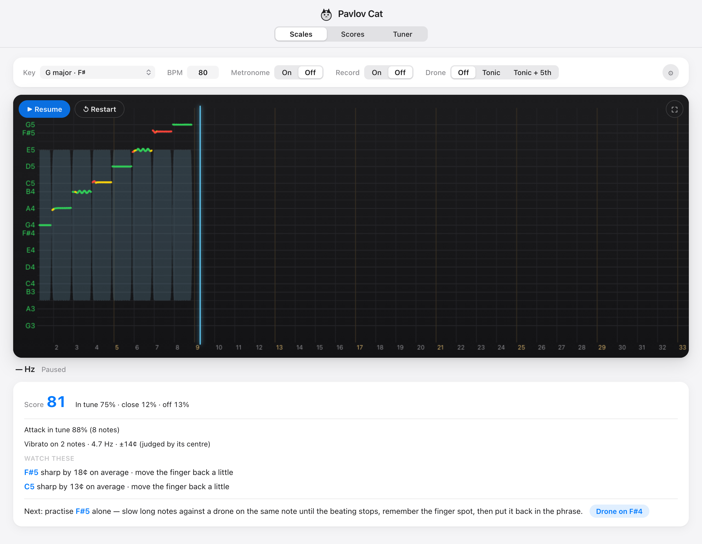

# Pavlov Cat

**English** · [中文](README.zh-CN.md)

A violin intonation trainer that runs in the browser. Play into the mic and see, note by note, whether you're in tune — then get a short report on what to fix next.

**▶ Try it: https://mmooyyii.github.io/pavlov-cat/** — free, no sign-up, no install.



## Why

I'm an adult learning the violin. Without a teacher next to you, it's hard to know whether a note is actually in tune. A tuner tells you the frequency, but it doesn't follow a scale or a piece, it reads vibrato as being out of tune, and it can't tell a note that landed in tune from one you slid into. So I built the tool I wanted for my own practice.

## Features

- **Scales**: pick any of the 24 keys. Notes in the scale are labelled on the pitch axis and your pitch is drawn as a coloured trace (green / yellow / red).
- **Scores**: import MusicXML (`.musicxml` / `.mxl`) by file or by folder, then play along. Built-in samples include Twinkle Twinkle, Lightly Row, Ode to Joy, Bach's Minuet in G and two-octave G / A major scales.
  - **Wait for me** mode: it stops on each note and only moves on once you play it in tune. Useful for reading a new piece.
- **Tuner** for the four open strings.
- **Practice report** after each run:
  - score, plus share of time in tune / close / off
  - **attack accuracy**: how many notes were in tune the moment they started, and whether you tend to slide up or down into notes
  - **vibrato**: rate, width, and pitch judged by the centre of the oscillation
  - the notes that were most off, and which way to move the finger
  - a one-click **next step** (slow down, turn on a drone, drill one note, or speed up)
  - approximate rhythm timing, with mic latency calibration
- **Drone** (tonic, or tonic + fifth), **metronome** with several sounds, **count-in**, and **recording** with playback in the page.
- **Equal temperament or just intonation**. Reference pitch is **A4 = 442 Hz**, a common orchestra standard.
- Works on desktop, Android tablets and phones; installable as a PWA and works offline. English and Chinese UI.

## How it judges intonation

Pitch detection uses [pitchy](https://github.com/ianprime0509/pitchy) (McLeod Pitch Method). What this project adds is the judging on top of the detected pitch:

- **Vibrato isn't marked as out of tune.** A held note (≥ 0.35 s) that oscillates is detected as vibrato, and its pitch is judged by the centre of the wobble — what the ear hears — not frame by frame.
- **Attack vs. settled pitch.** Each note's first moment is checked separately, so "found the note after landing" shows up in the report even if the note ends up in tune.
- **Tolerance** defaults to ±6¢ for green and ±15¢ for yellow, adjustable in ⚙.
- **Rhythm** is measured against the beat after subtracting the mic latency you calibrate.

## Privacy

Audio is analysed locally in your browser. Nothing is uploaded. Imported scores are kept in the browser's IndexedDB.

## Development

```bash
npm install
npm run dev     # http://localhost:5173/pavlov-cat/
npm run build
```

TypeScript + Vite, no framework. Mic access needs https or localhost.
