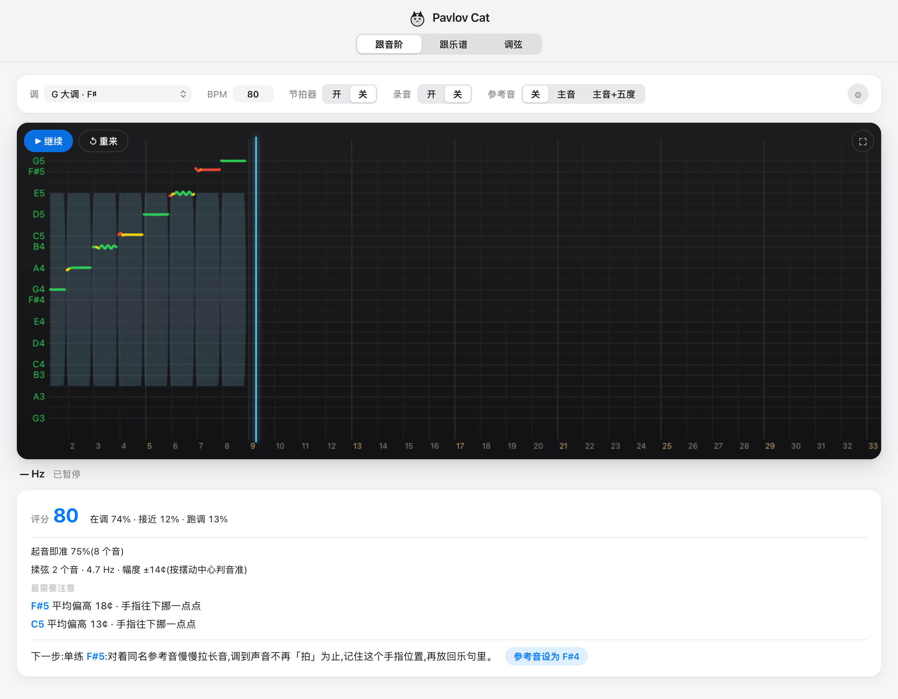

# Pavlov Cat

[English](README.md) · **中文**

在浏览器里练小提琴音准。对着麦克风拉，一个音一个音地看准不准；拉完给一份简短的报告，告诉你下一步该练什么。

**▶ 在线试用：https://mmooyyii.github.io/pavlov-cat/** —— 免费，不用注册，不用安装。



## 为什么做这个

我是成人学小提琴。身边没有老师的时候，很难知道一个音到底准不准。调音器能告诉你频率，但它不会跟着音阶或曲子走，会把揉弦当成跑调，也分不清一个音是一落指就准，还是滑过去才找准的。所以我做了一个自己练琴想用的工具。

## 功能

- **跟音阶**：24 个调任选，音高轴上标出音阶内的音，你拉的音高画成一条彩色轨迹（绿 / 黄 / 红）。
- **跟乐谱**：导入 MusicXML（`.musicxml` / `.mxl`），可以选文件，也可以整个文件夹导入，然后跟着拉。内置示例：小星星、小汉斯、欢乐颂、巴赫 G 大调小步舞曲，以及 G / A 大调两个八度音阶。
  - **等我拉对再走**：走到每个音停下来等，拉准了才往下走，适合刚开始读一首新曲子。
- **调弦**：四根空弦的调音器。
- **练习报告**（每拉完一遍）：
  - 评分，以及在调 / 接近 / 跑调各占多少时间
  - **起音即准率**：有多少个音一落指就是准的，以及你是习惯从低处滑上去还是从高处落下来
  - **揉弦**：频率、幅度，并按摆动中心判音准
  - 最不准的几个音，以及手指该往哪边挪
  - 一键**下一步**：降速、开参考音、单练某个音，或者提速
  - 近似的节奏评分，支持麦克风延迟校准
- **参考音**（主音，或主音 + 五度）、多种音色的**节拍器**、**预备拍**、**录音**并在页面里直接回放。
- **平均律或纯律**。基准音高 **A4 = 442 Hz**，这是乐团常用的标准。
- 支持电脑、安卓平板和手机；可以作为 PWA 安装，离线也能用。界面有中文和英文。

## 怎么判断音准

音高检测用的是 [pitchy](https://github.com/ianprime0509/pitchy)（McLeod 音高检测法）。这个项目做的是检测之后的判断：

- **揉弦不算跑调。** 持续 0.35 秒以上、音高来回摆动的音会被识别为揉弦，按摆动的中心判音准（耳朵听到的也是中心），而不是逐帧判断。
- **起音和最终音高分开看。** 每个音刚开始的那一下单独判断，所以即使最后拉准了，"落指后才找准"也会在报告里体现出来。
- **容差**默认绿色 ±6 音分、黄色 ±15 音分，可以在 ⚙ 里调。
- **节奏**按节拍计算，扣除你校准出的麦克风延迟。

## 隐私

声音只在你的浏览器里本地分析，不会上传。导入的乐谱保存在浏览器的 IndexedDB 里。

## 开发

```bash
npm install
npm run dev     # http://localhost:5173/pavlov-cat/
npm run build
```

TypeScript + Vite，没有用前端框架。麦克风需要在 https 或 localhost 下才能用。
